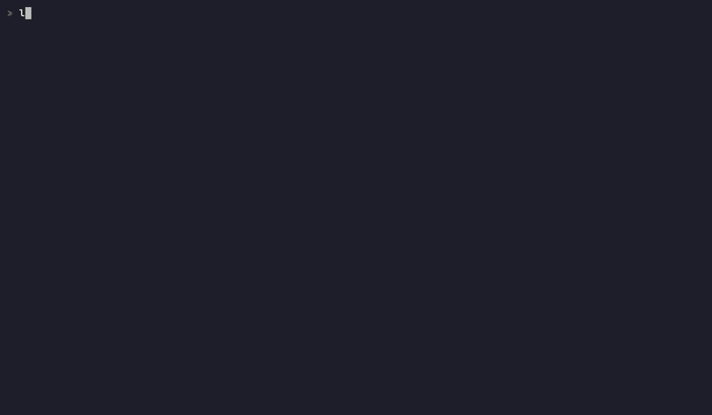
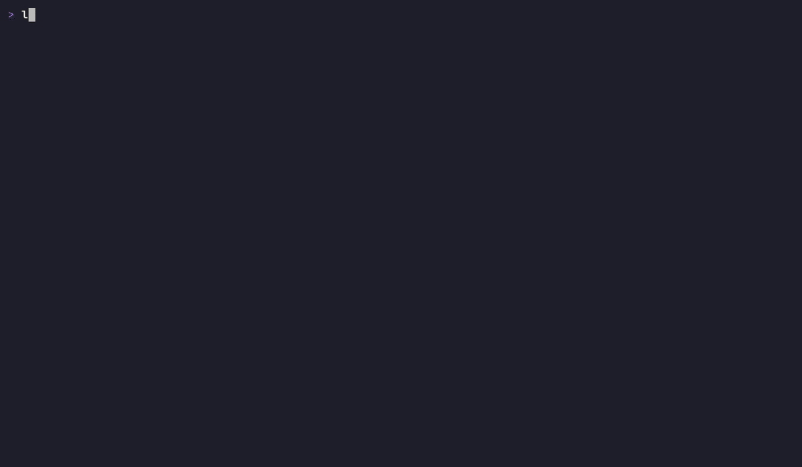

# lazyncu

[](https://github.com/luchrv/lazyncu/releases/latest)
[](go.mod)
[](LICENSE)
[](https://github.com/luchrv/lazyncu/releases)
[](https://github.com/luchrv/homebrew-tap)

A read-only terminal dashboard for [npm-check-updates](https://github.com/raineorshine/npm-check-updates). It answers one question at a glance: **which of my projects need updates, and how urgent are they?**


- Scans **global packages** (`ncu -g`) and every **registered path** in parallel on launch.
- Auto-detects what each path is — single project, monorepo, or folder of projects — and picks `ncu` or `ncu --deep` accordingly. Zero per-path configuration.
- Classifies every upgrade as **major / minor / patch** with color coding and per-project counters.
- Respects each project's **`engines.node`**: suggestions are limited to versions the project can actually install, and the detail panel shows the project's declared node version (`.nvmrc` or `engines.node`).
- Runs **`npm audit` / `pnpm audit`** per project alongside the version scan: severity counters (critical/high/moderate/low), vulnerable-package detail, and the dependency chain that drags each vulnerability in (`lodash ← express`).
- **Never modifies anything.** It shows the exact update/fix command for the current selection and copies it to your clipboard.

## Requirements

- [npm-check-updates](https://github.com/raineorshine/npm-check-updates) >= 18 on PATH. The Homebrew install brings it in automatically; with a prebuilt binary, `go install`, or a source build, install it yourself: `npm install -g npm-check-updates`
- `npm` (and `pnpm` if you want pnpm projects audited)
- Network access (ncu queries the npm registry; audit queries the advisory endpoint)

## Install

Homebrew (macOS/Linux) — installs npm-check-updates as a dependency, no extra step:

```sh
brew install luchrv/tap/lazyncu
```

Prebuilt binaries for linux/macOS/windows (amd64/arm64) are on the
[releases page](https://github.com/luchrv/lazyncu/releases).

With Go:

```sh
go install github.com/luchrv/lazyncu@latest
```

Or from source:

```sh
git clone https://github.com/luchrv/lazyncu && cd lazyncu && make build
```

## Usage

```sh
lazyncu
```

`lazyncu --version` prints the version, commit, and build date.

All sources scan in parallel; results stream in as each finishes. Select a source or project in the left panel to see its packages, toggle the vulnerability view, and copy the suggested command.

### Keybindings

Keys are scoped to the focused panel: pressing a key where it doesn't apply
shows a short hint instead of firing blind, and the bottom help bar always
reflects exactly what works right now.

| Key | Scope | Action |
|-----|-------|--------|
| `q` | global | Quit |
| `?` | global | Keymap cheat sheet with the counter legend — close with `Esc` or `?` |
| `c` | global | Copy the visible command (update command; fix command in the vulnerability view) |
| `v` | global | Toggle vulnerability detail view |
| `r` | global | Rescan the selected source (asks for confirmation when marked packages would be lost; disabled while already scanning) |
| `R` | global | Rescan every idle source at once (one aggregate confirmation if any marks would be lost) |
| `m` | global | Hide/show status messages (bottom left) |
| `h` | global | About (version, commit, build date) — close with `Esc` or `h` |
| `Tab` | global | Move focus between the sources tree and the packages table |
| `1` / `2` | global | Jump focus straight to the sources tree / packages table |
| `a` | sources | Add a path (validated, persisted, scanned immediately) |
| `d` | sources | Remove the selected path (asks for confirmation; the folder on disk is never touched) |
| `Enter` | sources | Collapse/expand the selected source's project list |
| `Space` | packages table | Mark/unmark a package — the update command narrows to the marked ones |
| `x` | packages table | Clear all marks of the current project |
| `s` | table (both views) | Cycle row order: scan → severity → name (shown in the title) |
| `/` | table (both views) | Incremental filter by package name — `Enter` keeps it, `Esc` clears |
| `Esc` | anywhere | Peel one layer: clear the filter, leave the table, or collapse the selected source |
| `↑↓` | — | Navigate sources/projects, or table rows when the table is focused |

Severity counters in the sources panel use two distinct alphabets — shapes
for pending updates, letters for vulnerabilities (legend also in `?`).
Every source row aggregates its projects' counters, so a collapsed source
keeps its signal:

| Counter | Meaning |
|---------|---------|
| `▲3 ●5 ▪2` | 3 major, 5 minor, 2 patch updates pending |
| `C1 H2 M3 L4` | 1 critical, 2 high, 3 moderate, 4 low vulnerabilities |

While sources scan, their rows animate a spinner and the bottom bar shows
aggregate progress (`scanning 3/5`). Status messages carry a severity icon
(`·` info, `✓` ok, `!` warning, `✗` error) and clear themselves after a few
seconds — errors stay until replaced.

Mark packages with `Space` to narrow the update command to just those:



### Suggested commands (shown, never executed)

| Context | Command |
|---------|---------|
| Global packages | `npm install -g pkg@x.y.z ...` |
| Marked packages only | `cd <dir> && ncu -u pkg1 pkg2 && npm install` (or the global subset) |
| npm project | `cd <dir> && ncu -u && npm install` |
| pnpm project | `cd <dir> && ncu -u && pnpm install` |
| yarn project | `cd <dir> && ncu -u && yarn` |
| Vulnerabilities (npm) | `cd <dir> && npm audit fix` |
| Vulnerabilities (pnpm) | `cd <dir> && pnpm audit --fix` |

## Configuration

`$XDG_CONFIG_HOME/lazyncu/config.toml` (default `~/.config/lazyncu/config.toml`), created on first launch. Manage paths from the UI (`a` registers a path, persists it, and scans it immediately) or edit by hand:



> **Renamed from ncu-tui:** an existing `~/.config/ncu-tui/` is ignored — no migration. Re-add your paths with `a` (or copy the old `config.toml` into the new directory yourself).

```toml
timeout_ms = 30000   # per-command timeout (default 30000)

[[paths]]
path = "/Users/me/projects"        # folder of projects → ncu --deep

[[paths]]
path = "/Users/me/projects/my-app" # single project → ncu
```

How a path is scanned is re-detected on every launch:

| Path contents | Mode |
|---------------|------|
| No `package.json` | `ncu --deep` (folder of projects) |
| `package.json` with `workspaces`, or `pnpm-workspace.yaml` | `ncu --deep` (monorepo) |
| Plain `package.json` | `ncu` |

## Audit coverage notes

Press `v` on a project to see its vulnerabilities: severity, affected range, whether a fix exists, and the dependency chain that drags each one in.


- **Global packages are not audited** — `npm audit` requires a lockfile and does not support global installs. The UI shows "audit n/a", which is distinct from "0 vulns".
- **Yarn projects are not audited** in v1 (yarn classic emits a different audit format). Version scanning works normally.
- `npm audit` exiting non-zero *with* valid JSON means vulnerabilities exist — that is a successful audit, and the dashboard treats it as such.

## Development

```sh
make check          # gofmt + go vet + race tests + coverage
make build          # binary with version metadata injected via ldflags
make release-check  # dry-run the goreleaser pipeline locally (needs goreleaser)
```

Releases are automated: pushing a `v*` tag runs goreleaser via GitHub Actions.
See [docs/RELEASING.md](docs/RELEASING.md).

Business logic lives in pure, exec-injected packages (`config`, `detect`, `scanner`, `semver`, `command`, `audit`, `orchestrator`); the `ui` package is a thin tview layer where every async widget update passes through a single `QueueUpdateDraw` choke point.

## License

See [LICENSE](LICENSE).
